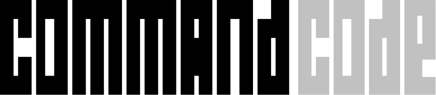

<div align="center">

# ascii.rest

<a href="https://ascii.rest/donut/">
  <picture>
    <source media="(prefers-color-scheme: dark)" srcset=".github/donut-dark.svg">
    
  </picture>
</a>

<sub>Thanks to the sponsors who make running ascii.rest possible</sub>

<a href="https://commandcode.ai"><picture><source media="(prefers-color-scheme: dark)" srcset="site/public/sponsors/command-code.dark.svg"></picture></a>&nbsp;&nbsp;&nbsp;&nbsp;&nbsp;&nbsp;&nbsp;&nbsp;<a href="https://www.cloudflare.com"><picture><source media="(prefers-color-scheme: dark)" srcset="site/public/sponsors/cloudflare.dark.svg"></picture></a>

<br>

Animated ascii art for web pages.<br>
216 pieces for React, Next.js, Astro or plain HTML.

[ascii.rest](https://ascii.rest) · [install](#install) · [pieces](#pieces) · [contributing](CONTRIBUTING.md)

[](https://github.com/bas3line)
[](https://github.com/bas3line/ascii/actions/workflows/ci.yml)
[](https://www.npmjs.com/package/ascii.rest)
[](LICENSE)
[](src/types.ts)

</div>

<br>

Written in TypeScript by [@bas3line](https://github.com/bas3line). 216 pieces, from full-colour scenes to loaders, charts, language logos, Linux distros, spinning shapes and physics. The donut above turns on a page with one tag: `<ascii-art piece="donut"></ascii-art>`. See them all at [ascii.rest](https://ascii.rest).

<p align="center">
  <a href="https://ascii.rest/night-coast/"></a>
  <a href="https://ascii.rest/aurora-fjord/"></a>
  <a href="https://ascii.rest/earthrise/"></a>
  <a href="https://ascii.rest/kyoto-dusk/"></a>
  <a href="https://ascii.rest/torus-knot/"></a>
  <a href="https://ascii.rest/taj-dawn/"></a>
</p>

## Why

I've always been a fan of Markdown files and terminal-style websites: plain text, one monospace face, nothing that moves without a reason. The kind of quiet web that [planetscale.com](https://planetscale.com) does well. So I made this, a way to put a little motion on pages like that without giving up the style. If you like minimalism, this library is for you.

## Install

```sh
npm install ascii.rest
```

Or skip installing: the [HTML tag](#html-no-build-step) loads everything from ascii.rest.

## React and Next.js

```tsx
import { Ascii } from "ascii.rest/react";
import { donut } from "ascii.rest/pieces";

<Ascii piece={donut} />
<Ascii piece="night-coast" />                          // fetched by name when it mounts
<Ascii piece={donut} options={{ fps: 12 }} className="art" />
<Ascii piece="rust" mono />                            // a logo in one ink
```

`Ascii` is a client component (`"use client"`), so it goes straight into the Next.js app router. Text pieces draw into a `<pre>` in its colour and font size; the coloured ones, scenes, logos, companies and distros, draw onto a `<canvas>` as wide as its container, or into a `<pre>` in one ink with `mono`.

## Astro

```astro
---
import Ascii from "ascii.rest/astro";
---

<Ascii piece="donut" />
<Ascii piece="big-text" options={{ text: "hello" }} class="banner" />
```

The first frame is rendered on the server, so the page is whole before any script runs; the piece starts playing once the page loads.

## HTML, no build step

```html
<script type="module" src="https://ascii.rest/ascii.js"></script>

<ascii-art piece="donut"></ascii-art>
```

Style it like text: `ascii-art { font-size: 10px; color: teal; }`. The logos, companies and distros come in their own colours; add `mono`, `<ascii-art piece="rust" mono>`, to draw one in the text's colour instead. In a bundled app, `import "ascii.rest/element"` defines the same tag.

## In a GitHub README

A README runs no script, so every logo, company and distro also comes as an animated SVG, one loop of its glint or scan, at `https://ascii.rest/svg/<name>.svg` for light pages and `<name>.dark.svg` for dark ones:

```html
<picture>
  <source media="(prefers-color-scheme: dark)" srcset="https://ascii.rest/svg/rust.dark.svg">
  
</picture>
```

GitHub shows the dark one in its dark theme. Each piece's page on ascii.rest has its snippet under `readme`.

### Banners

Your name, or your project's, in [big text](https://ascii.rest/big-text/)'s block letters with a glint that passes now and then, sized to the text:

```html
<a href="https://ascii.rest/banner/">
  <picture>
    <source media="(prefers-color-scheme: dark)" srcset="https://ascii.rest/banner/my-project.dark.svg">
    
  </picture>
</a>
```

The URL is the banner: `https://ascii.rest/banner/<text>.svg`, and `.dark.svg` for GitHub's dark theme. It takes up to 20 characters, letters, digits, spaces and `. , ! ? ' : - + = / _`, drawn in capitals, in GitHub's own text colour; `?color=ff6a00` colours the letters. [ascii.rest/banner](https://ascii.rest/banner/) makes one as you type and gives the snippet.

## In a terminal

```sh
npx ascii.rest rust                        # plays until you press a key
npx ascii.rest night-coast --seconds 10
npx ascii.rest list                        # every piece's name, by category
npx ascii.rest banner 'my cli'             # your text in block letters
```

The logos, companies, distros and scenes play in their own colours, in 24-bit colour. A scene is shrunk to fit the terminal, whatever its size, and drawn in tones, two of its rows in each of the terminal's as half blocks, so the dots it is made of blend as they do on a page. `--mono` draws a coloured piece in the terminal's own colour, for a terminal without 24-bit colour, and `--light` takes the colours meant for a light background. `--fps` and `--seconds` set the speed and the length. The piece plays centred; any other piece wider or taller than the terminal shows only its middle, and it says so when it stops. Piped or redirected, it prints its first frame as text.

### As a splash screen

```ts
import { play } from "ascii.rest/terminal";

const { interrupted } = await play("command-code", { seconds: 2 });
if (interrupted) process.exit(130);
```

`play(piece, options?)` takes a piece module or a name and resolves when the piece stops: after `seconds`, on any key, or on Ctrl+C, which sets `interrupted`. It plays on the alternate screen with the cursor hidden, and puts the terminal back however it stops, on an error too. When the output is not a terminal it draws nothing and resolves at once, so a pipe or a CI log never gets a splash. It uses only Node's own modules.

| option | |
| --- | --- |
| `seconds` | how long it plays; until a key is pressed by default |
| `mono` | draws a coloured piece in the terminal's own colour |
| `light` | for a light terminal: the light colours, and shaded pieces flipped |
| `fps` | frames a second, instead of the piece's own |
| `options` | the piece's option overrides: `{ text: "hello" }` |
| `out` | where it draws: `process.stdout` by default |

It resolves with `{ interrupted, cropped, piece, terminal }`: `cropped` is true when the terminal was smaller than the piece, whose size and the terminal's are in `piece` and `terminal`.

### As a banner

```ts
import { banner } from "ascii.rest/terminal";

await banner("my-cli", { color: "#ff6a00" });
```

`banner(text, options?)` prints the text in [big text](https://ascii.rest/big-text/)'s block letters where the cursor is, lets the glint pass once and resolves, leaving the banner in the scrollback with the rest of your output, unlike `play()`, which takes over the screen. It is sized to the text, with narrower letters if the terminal is too narrow for square ones and the plain text if it is too narrow for those. Piped, it prints the banner with no colour and resolves at once; `NO_COLOR` leaves out the colours too. `npx ascii.rest banner <text>` takes the same options as `--seconds`, `--color` and `--light`.

| option | |
| --- | --- |
| `seconds` | how long the glint takes to pass; 1 by default, 0 prints it still |
| `color` | the letters' colour as `#rrggbb`; the terminal's own by default, and the shadow is dimmed |
| `light` | for a light terminal: solid letters that the glint lightens |
| `out` | where it prints: `process.stdout` by default |

It resolves with `{ cols, rows, interrupted }`: the banner's size, 0 by 0 if it printed the plain text, and `interrupted` if Ctrl+C stopped the glint.

## TypeScript, anywhere

```ts
import { mount } from "ascii.rest";
import { donut } from "ascii.rest/pieces";

const stop = mount(document.querySelector("pre")!, donut, { fps: 12 });
```

## API

### `mount(element, piece, options?)`

Plays `piece` in `element` and returns a function that stops it.

- `element`: a `<pre>` for text pieces, a `<canvas>` for the coloured ones (`canvas.has(name)` tells you which). A coloured piece in a `<pre>` is drawn in one ink.
- `piece`: a piece module, such as `donut` from `ascii.rest/pieces`.
- `options`: overrides the piece's option defaults, plus `fps` to change its frame rate, and `motion: true` to play even when the reader prefers reduced motion. Pieces hold their first frame for those readers by default; set `motion` only behind a control the reader chooses, like the site's `[play anyway]`.

### `load`, `names`, `canvas`, `isPiece`

From `ascii.rest`. `load["night-coast"]()` imports any piece by name, `names` lists every name, `canvas` is the set of pieces drawn on a canvas, and `isPiece(name)` narrows a string to a piece name.

### `<Ascii>` (React)

| prop | type | |
| --- | --- | --- |
| `piece` | piece module or name | a module is bundled, a name is fetched when it mounts |
| `options` | object | option overrides, and `fps` |
| `label` | string | what it shows, for screen readers; the piece's name by default |
| `mono` | boolean | draws a coloured piece in one ink, in a `<pre>` |
| `className`, `style` | | passed to the `<pre>` or `<canvas>` |

### `<Ascii>` (Astro)

`piece` (a name), `options`, `fps`, `label`, `mono` and `class`.

### `<ascii-art>`

| attribute | |
| --- | --- |
| `piece` | a piece's name: `donut`, `night-coast` |
| `src` | or the URL of any module that follows the piece contract |
| `fps` | overrides the frame rate |
| `options` | JSON overriding the option defaults: `'{"text":"hello"}'` |
| `label` | what it shows, for screen readers |
| `mono` | draws a coloured piece in one ink, the text's colour |

## Browser support

Any current browser: it needs ES modules, custom elements and `IntersectionObserver`, plus `ResizeObserver` for the coloured pieces. Importing any module on a server, for server rendering, is safe: nothing touches the DOM until a piece is mounted.

Many pieces draw with box drawing and block glyphs (`─ │ ╭ █ ▄ ░`). Where the system monospace face has none, as on Android, the tag and the Astro component take them from "ascii.rest mono", a 3 KB cut of [JetBrains Mono](https://github.com/JetBrains/JetBrainsMono) (OFL) served by ascii.rest, so every row keeps its width. Only a browser that lacks the glyphs fetches it. With React, put it in your own `<pre>`'s font stack:

```css
@font-face {
  font-family: "ascii.rest mono";
  src: url("https://ascii.rest/fonts/ascii-rest-mono.woff2") format("woff2");
  unicode-range: U+00B0, U+00B7, U+2022, U+2500-259F, U+25CF;
}
pre.art { font-family: ui-monospace, SFMono-Regular, Menlo, Consolas, "Liberation Mono", "ascii.rest mono", monospace; }
```

## Pieces

| category | pieces |
| --- | --- |
| scenes | [alpine dawn](https://ascii.rest/alpine-dawn/), [aurora fjord](https://ascii.rest/aurora-fjord/), [deep reef](https://ascii.rest/deep-reef/), [desert night](https://ascii.rest/desert-night/), [earthrise](https://ascii.rest/earthrise/), [kyoto dusk](https://ascii.rest/kyoto-dusk/), [lantern lake](https://ascii.rest/lantern-lake/), [marine drive](https://ascii.rest/marine-drive/), [misty forest](https://ascii.rest/misty-forest/), [night coast](https://ascii.rest/night-coast/), [ocean sunset](https://ascii.rest/ocean-sunset/), [storm plains](https://ascii.rest/storm-plains/), [taj dawn](https://ascii.rest/taj-dawn/), [tokyo rain](https://ascii.rest/tokyo-rain/), [varanasi ghats](https://ascii.rest/varanasi-ghats/) |
| ui | [boot log](https://ascii.rest/boot-log/), [box frames](https://ascii.rest/box-frames/), [calendar](https://ascii.rest/calendar/), [digital clock](https://ascii.rest/digital-clock/), [dividers](https://ascii.rest/dividers/), [file tree](https://ascii.rest/file-tree/), [form controls](https://ascii.rest/form-controls/), [not found](https://ascii.rest/not-found/), [progress bar](https://ascii.rest/progress-bar/), [skeleton](https://ascii.rest/skeleton/), [spinners](https://ascii.rest/spinners/), [terminal](https://ascii.rest/terminal/) |
| data | [bar chart](https://ascii.rest/bar-chart/), [candlesticks](https://ascii.rest/candlesticks/), [cpu meters](https://ascii.rest/cpu-meters/), [equalizer](https://ascii.rest/equalizer/), [gauge](https://ascii.rest/gauge/), [heartbeat](https://ascii.rest/heartbeat/), [heatmap](https://ascii.rest/heatmap/), [radar](https://ascii.rest/radar/), [sparkline](https://ascii.rest/sparkline/), [uptime bar](https://ascii.rest/uptime-bar/) |
| type | [big text](https://ascii.rest/big-text/), [dissolve](https://ascii.rest/dissolve/), [glitch](https://ascii.rest/glitch/), [marquee](https://ascii.rest/marquee/), [morse](https://ascii.rest/morse/), [scramble](https://ascii.rest/scramble/), [split-flap](https://ascii.rest/split-flap/), [typewriter](https://ascii.rest/typewriter/), [wave text](https://ascii.rest/wave-text/) |
| logos | [c](https://ascii.rest/c/), [c#](https://ascii.rest/csharp/), [c++](https://ascii.rest/cpp/), [clojure](https://ascii.rest/clojure/), [css](https://ascii.rest/css/), [dart](https://ascii.rest/dart/), [elixir](https://ascii.rest/elixir/), [elm](https://ascii.rest/elm/), [erlang](https://ascii.rest/erlang/), [go](https://ascii.rest/go/), [haskell](https://ascii.rest/haskell/), [html](https://ascii.rest/html/), [java](https://ascii.rest/java/), [javascript](https://ascii.rest/javascript/), [julia](https://ascii.rest/julia/), [kotlin](https://ascii.rest/kotlin/), [lua](https://ascii.rest/lua/), [ocaml](https://ascii.rest/ocaml/), [perl](https://ascii.rest/perl/), [php](https://ascii.rest/php/), [python](https://ascii.rest/python/), [r](https://ascii.rest/r/), [ruby](https://ascii.rest/ruby/), [rust](https://ascii.rest/rust/), [scala](https://ascii.rest/scala/), [svelte](https://ascii.rest/svelte/), [swift](https://ascii.rest/swift/), [typescript](https://ascii.rest/typescript/), [zig](https://ascii.rest/zig/) |
| companies | [a0](https://ascii.rest/a0/), [agentmail](https://ascii.rest/agentmail/), [apple](https://ascii.rest/apple/), [autumn](https://ascii.rest/autumn/), [cloudflare](https://ascii.rest/cloudflare/), [coderabbit](https://ascii.rest/coderabbit/), [collabute](https://ascii.rest/collabute/), [command code](https://ascii.rest/command-code/), [databuddy](https://ascii.rest/databuddy/), [greptile](https://ascii.rest/greptile/), [helium](https://ascii.rest/helium/), [keiki](https://ascii.rest/keiki/), [mintlify](https://ascii.rest/mintlify/), [orchid](https://ascii.rest/orchid/), [planetscale](https://ascii.rest/planetscale/), [playstation](https://ascii.rest/playstation/), [polar](https://ascii.rest/polar/), [supabase](https://ascii.rest/supabase/), [supermemory](https://ascii.rest/supermemory/), [vercel](https://ascii.rest/vercel/) |
| distros | [almalinux](https://ascii.rest/almalinux/), [alpine linux](https://ascii.rest/alpine-linux/), [arch linux](https://ascii.rest/arch-linux/), [centos](https://ascii.rest/centos/), [debian](https://ascii.rest/debian/), [deepin](https://ascii.rest/deepin/), [elementary os](https://ascii.rest/elementary-os/), [endeavouros](https://ascii.rest/endeavouros/), [fedora](https://ascii.rest/fedora/), [gentoo](https://ascii.rest/gentoo/), [kali linux](https://ascii.rest/kali-linux/), [linux mint](https://ascii.rest/linux-mint/), [manjaro](https://ascii.rest/manjaro/), [nixos](https://ascii.rest/nixos/), [omarchy](https://ascii.rest/omarchy/), [opensuse](https://ascii.rest/opensuse/), [pop!_os](https://ascii.rest/pop-os/), [red hat](https://ascii.rest/red-hat/), [rocky linux](https://ascii.rest/rocky-linux/), [tux](https://ascii.rest/tux/), [ubuntu](https://ascii.rest/ubuntu/), [void linux](https://ascii.rest/void-linux/), [zorin os](https://ascii.rest/zorin-os/) |
| shapes | [cube](https://ascii.rest/cube/), [dna helix](https://ascii.rest/dna-helix/), [donut](https://ascii.rest/donut/), [glxgears](https://ascii.rest/glxgears/), [gyroscope](https://ascii.rest/gyroscope/), [heart](https://ascii.rest/heart/), [icosahedron](https://ascii.rest/icosahedron/), [mobius strip](https://ascii.rest/mobius-strip/), [spring](https://ascii.rest/spring/), [tesseract](https://ascii.rest/tesseract/), [torus knot](https://ascii.rest/torus-knot/), [twisted ring](https://ascii.rest/twisted-ring/) |
| space | [black hole](https://ascii.rest/black-hole/), [earth](https://ascii.rest/earth/), [eclipse](https://ascii.rest/eclipse/), [galaxy](https://ascii.rest/galaxy/), [moon phases](https://ascii.rest/moon-phases/), [planet](https://ascii.rest/planet/), [rocket](https://ascii.rest/rocket/), [saptarishi](https://ascii.rest/saptarishi/), [solar system](https://ascii.rest/solar-system/), [starfield](https://ascii.rest/starfield/), [three-body](https://ascii.rest/three-body/) |
| physics | [bouncing balls](https://ascii.rest/bouncing-balls/), [chladni plate](https://ascii.rest/chladni/), [double pendulum](https://ascii.rest/double-pendulum/), [falling sand](https://ascii.rest/falling-sand/), [flag](https://ascii.rest/flag/), [fountain](https://ascii.rest/fountain/), [harmonograph](https://ascii.rest/harmonograph/), [lorenz attractor](https://ascii.rest/lorenz/), [newton's cradle](https://ascii.rest/newtons-cradle/), [pendulum wave](https://ascii.rest/pendulum-wave/), [plucked string](https://ascii.rest/plucked-string/), [pond ripples](https://ascii.rest/pond-ripples/), [smoke](https://ascii.rest/smoke/), [wave interference](https://ascii.rest/wave-interference/) |
| nature | [aurora](https://ascii.rest/aurora/), [bonsai](https://ascii.rest/bonsai/), [campfire](https://ascii.rest/campfire/), [cherry blossom](https://ascii.rest/cherry-blossom/), [contour map](https://ascii.rest/contour-map/), [fern](https://ascii.rest/fern/), [fireflies](https://ascii.rest/fireflies/), [fractal tree](https://ascii.rest/fractal-tree/), [landscape](https://ascii.rest/landscape/), [lightning](https://ascii.rest/lightning/), [rain](https://ascii.rest/rain/), [ruled mountains](https://ascii.rest/ruled-mountains/), [sea swell](https://ascii.rest/sea-swell/), [snowfall](https://ascii.rest/snowfall/), [sunrise](https://ascii.rest/sunrise/), [wind](https://ascii.rest/wind/) |
| creatures | [aquarium](https://ascii.rest/aquarium/), [butterfly](https://ascii.rest/butterfly/), [cat](https://ascii.rest/cat/), [fox](https://ascii.rest/fox/), [jellyfish](https://ascii.rest/jellyfish/), [owl](https://ascii.rest/owl/), [snake](https://ascii.rest/snake/), [spider](https://ascii.rest/spider/), [starlings](https://ascii.rest/starlings/), [whale](https://ascii.rest/whale/) |
| objects | [analog clock](https://ascii.rest/analog-clock/), [candle](https://ascii.rest/candle/), [coffee](https://ascii.rest/coffee/), [ferris wheel](https://ascii.rest/ferris-wheel/), [hawa mahal](https://ascii.rest/hawa-mahal/), [hourglass](https://ascii.rest/hourglass/), [kite](https://ascii.rest/kite/), [lava lamp](https://ascii.rest/lava-lamp/), [lighthouse](https://ascii.rest/lighthouse/), [skyline](https://ascii.rest/skyline/), [sundial](https://ascii.rest/sundial/), [train](https://ascii.rest/train/), [vinyl](https://ascii.rest/vinyl/), [windmill](https://ascii.rest/windmill/) |
| generative | [epicycles](https://ascii.rest/epicycles/), [flow field](https://ascii.rest/flow-field/), [glider gun](https://ascii.rest/glider-gun/), [hilbert curve](https://ascii.rest/hilbert-curve/), [julia set](https://ascii.rest/julia-set/), [langton's ant](https://ascii.rest/langtons-ant/), [mandelbrot](https://ascii.rest/mandelbrot/), [maze](https://ascii.rest/maze/), [plasma](https://ascii.rest/plasma/), [reaction diffusion](https://ascii.rest/reaction-diffusion/), [rule 30](https://ascii.rest/rule-30/), [sierpinski](https://ascii.rest/sierpinski/), [voronoi](https://ascii.rest/voronoi/) |
| effects | [doom fire](https://ascii.rest/doom-fire/), [fireworks](https://ascii.rest/fireworks/), [matrix rain](https://ascii.rest/matrix-rain/), [rotozoomer](https://ascii.rest/rotozoomer/), [sparks](https://ascii.rest/sparks/), [synthwave](https://ascii.rest/synthwave/), [tunnel](https://ascii.rest/tunnel/), [tv static](https://ascii.rest/tv-static/) |

The logos and distros are drawn from [devicon](https://github.com/devicons/devicon) (MIT) and [Simple Icons](https://github.com/simple-icons/simple-icons) (CC0); omarchy's mark there is its own, MIT licensed, from [omarchy.org](https://omarchy.org). The companies are drawn from Simple Icons too, and a0, agentmail, autumn, coderabbit, collabute, command code, databuddy, greptile, keiki, orchid, polar and supermemory from their own marks on [a0.dev](https://a0.dev), [agentmail.to](https://www.agentmail.to), [useautumn.com](https://useautumn.com), [coderabbit.ai](https://www.coderabbit.ai/press-kit), [collabute.ai](https://collabute.ai), [commandcode.ai](https://commandcode.ai), [databuddy.cc](https://www.databuddy.cc), [greptile.com](https://www.greptile.com), [onkeiki.com](https://onkeiki.com), [orchid.ai](https://orchid.ai/brand), [polar.sh](https://polar.sh/brand) and [supermemory.ai](https://supermemory.ai). Each is a trademark of its owner, shown here to name the language, the distribution or the company.

## Contributing

New pieces, fixes and ideas are welcome. [CONTRIBUTING.md](CONTRIBUTING.md) covers the piece contract, the checks and how to open a pull request, and the [code of conduct](CODE_OF_CONDUCT.md) applies everywhere. Found a security problem? See [SECURITY.md](SECURITY.md).

## Author

Made by [@bas3line](https://github.com/bas3line). If you use it, a link back is appreciated, and so is a star.

To support it: [GitHub Sponsors](https://github.com/sponsors/bas3line), [Buy Me a Coffee](https://buymeacoffee.com/bas3line) or [PayPal](https://paypal.me/ShubhamYadav886).

## License

MIT, © [@bas3line](https://github.com/bas3line)
